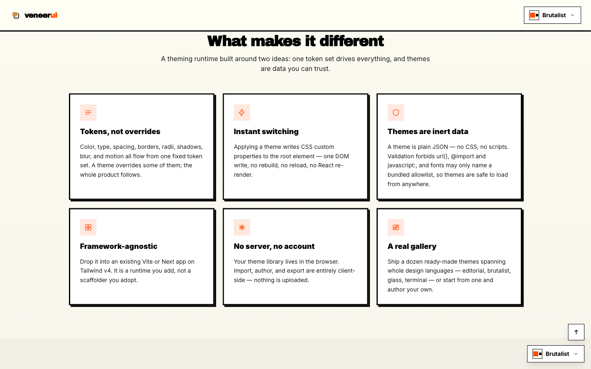
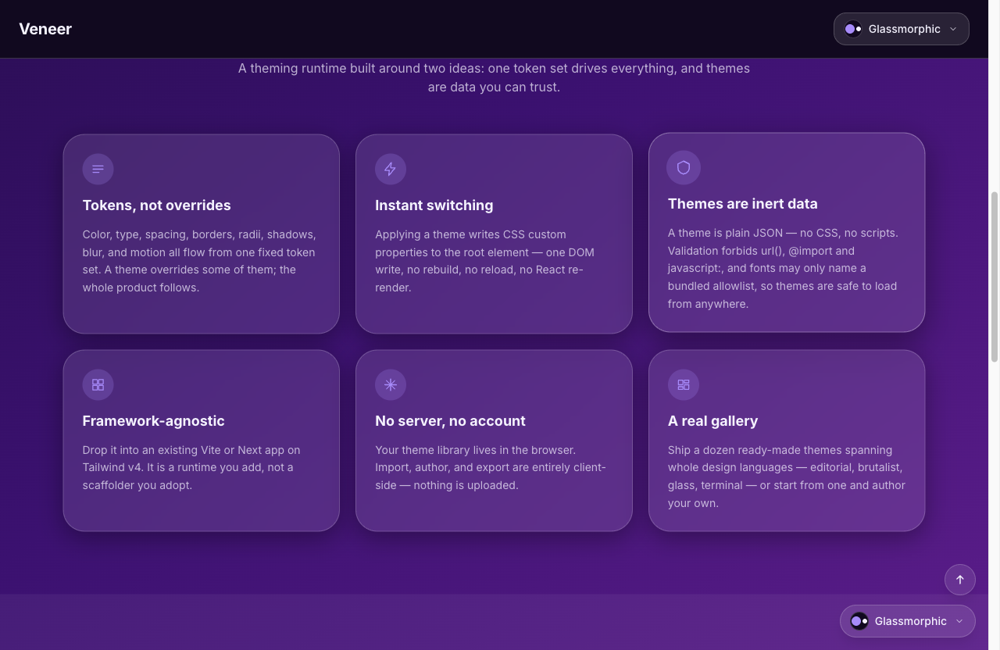
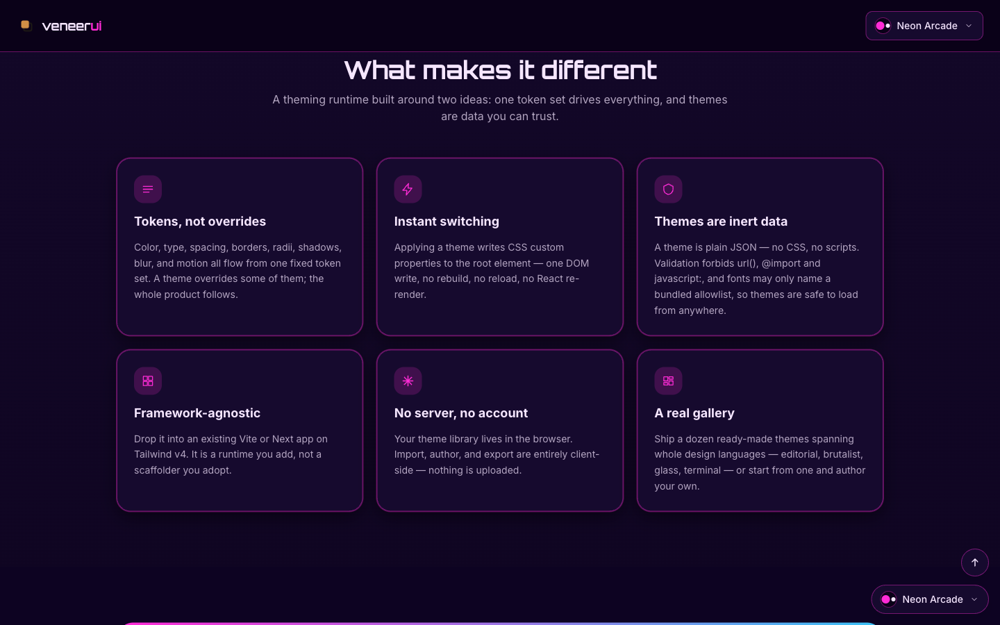
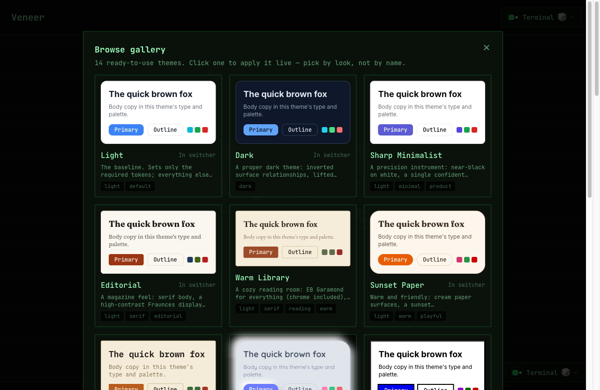
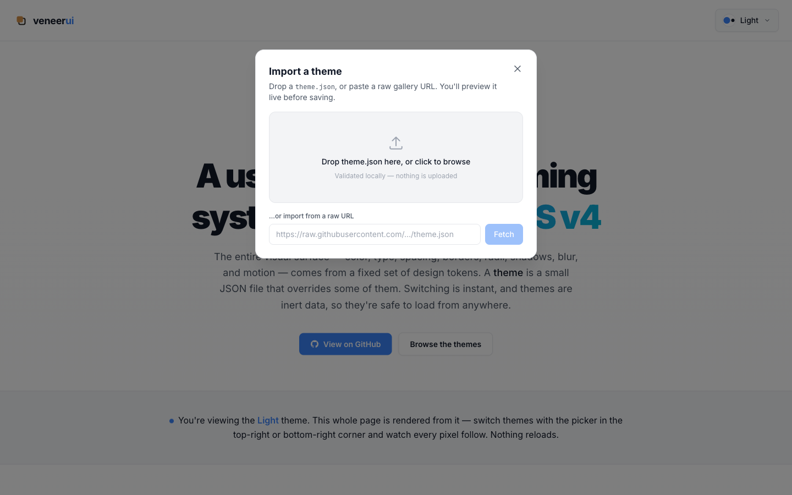

**A user-extensible theming system for Tailwind CSS v4.** The whole visual
surface of an app — color, type, spacing, borders, radii, shadows, blur, and
motion — is driven by a fixed set of design **tokens**. A *theme* is just a small
JSON file that overrides some of those tokens. Switching is instant (one DOM
write, no re-render); your app ships its own themes while users import and author
more; and because a theme is **inert data, not code**, it's safe to load from
untrusted sources. There's no server and no account — a user's theme library
lives in their browser's `localStorage`.

```
 Gallery (public JSON)  ──import──▶  Library  ──enable──▶  Enabled  ──select──▶  Current
   browse / paste a URL             everything you own     switcher subset      applied now
```

---

## Showcase

The same UI, re-skinned entirely by switching the theme — no component changes,
no reload.

| | | |
|---|---|---|
|  |  |  |
| **Brutalist** — thick black borders, hard offset shadows | **Glassmorphic** — frosted translucent panels on violet | **Neon Arcade** — magenta/cyan glow on near-black |

Users browse a built-in gallery, or drop a `theme.json` / paste a URL — every
theme is validated and previewed live before they keep it:

| | |
|---|---|
|  |  |
| **Browse gallery** — pick by look | **Import** — file or URL, validated locally |

---

## What you can build with it

- **A drop-in theme switcher** — let end-users pick from a curated set, with live
  preview swatches; their choice persists and re-applies before first paint.
- **Your own branded theme set** — define themes with `defineTheme` and ship them
  app-owned (non-deletable, re-seeded each load). Good for white-labeling.
- **User-imported & user-authored themes** — let people drop a `theme.json` or
  paste a raw URL; it's validated and previewed live before they save it.
- **A gallery of shareable themes** — distribute themes as plain JSON files
  anyone can fetch, import, and remix (the [`gallery/`](./gallery/README.md) model).
- **Showcase / demo sites** — shuffle a random theme on each visit to flaunt the
  range, until the visitor pins one.

---

## How it works

Tokens are declared in Tailwind v4's `@theme` block, so each one emits both a CSS
custom property *and* a utility class (`--color-primary` → `bg-primary`,
`--radius-md` → `rounded-md`). Components use only those semantic utilities — never
a hardcoded hex. A theme is a JSON document mapping token names to CSS values;
`applyTheme()` writes them as inline custom properties on `<html>`, which outrank
the `:root` defaults, so switching a theme re-skins everything instantly with no
re-render. Anything a theme omits falls back to the schema default.

Themes are **validated, not trusted**: a theme is *rejected* (never silently
degraded) if it uses unknown tokens, invalid CSS values, or any dangerous pattern
(`url()`, `@import`, `javascript:`, …). Because a theme can only set declared CSS
variables that compiled utilities already consume, there's no path from a theme to
new CSS, modified HTML, or executed code — the [token
schema](./docs/schema-reference.md) is the entire attack surface.

---

## Using Veneer in your app

Veneer is a **drop-in add-on, not a scaffolder** — keep your own Vite/Next +
Tailwind v4 project and add Veneer on top, the way you'd add shadcn/ui.

```sh
npm i @offthegully/veneerui
npx veneerui init            # @import the tokens, wire the anti-flash, print the provider step
npx veneerui add switcher    # copy a ThemeSwitcher into your components
```

The one required interlock is a line of CSS — `@import "@offthegully/veneerui/tokens.css";`
after `@import "tailwindcss";` — which makes Tailwind v4 generate the token
utilities Veneer overrides at runtime. The runtime (`ThemeProvider`, `useTheme`,
validation, import pipeline) is a normal dependency; UI components are **copied
into your project** (shadcn-style) because Tailwind v4 doesn't scan `node_modules`.

To ship **your own** themes instead of the built-ins, author them with
`defineTheme` and pass them in:

```tsx
import { ThemeProvider, defineTheme } from '@offthegully/veneerui'

const themes = [
  defineTheme({ id: 'brand', name: 'Brand', tokens: { 'color-primary': '#5b21b6', /* … */ } }),
  defineTheme({ id: 'brand-dark', name: 'Brand Dark', tokens: { /* … */ } }),
]

// <ThemeProvider themes={themes} defaultThemeId="brand">…</ThemeProvider>
```

Step-by-step, CLI and manual:
**[Vite guide](./docs/integration-vite.md)** · **[Next.js guide](./docs/integration-next.md)**.

---

## Authoring your own theme

There's no in-app editor — you author JSON in your own editor and preview it in a
running app. Copy the closest [gallery](./gallery/README.md) theme, keep its
`$schema` line for autocomplete, edit the token values you care about (anything you
omit uses the default), then drop the file into **Manage themes** to preview,
iterate, and save.

See the **[authoring guide](./docs/authoring-guide.md)** for picking a coherent
palette (the light/dark surface flip, the `text-on-primary` trap, contrast) and
the generated **[token reference](./docs/schema-reference.md)** for every token you
can set.

---

## Developer usage

This is an npm **workspace** monorepo (`packages/theme`, `packages/cli`,
`apps/playground`). Clone it to test or author themes against the live playground.
**Prerequisites:** Node 20+ and npm.

```sh
git clone <repo-url> veneerui && cd veneerui
npm install
npm run dev          # builds @offthegully/veneerui, then runs the playground at http://localhost:5173
```

The playground is the dev harness: it ships the gallery themes with the switcher,
import, and live-preview flow wired up, so dropping a `theme.json` into **Manage
themes** is how you preview a theme you're working on.

| Command | What it does |
|---|---|
| `npm run dev` | Build `@offthegully/veneerui`, then run the playground dev server |
| `npm run build` | Generate artifacts → build the package, playground, and CLI |
| `npm run gen:theme` | Regenerate the tokens CSS / JSON Schema / token reference from `TOKEN_SCHEMA` |
| `npm run lint` | ESLint across workspaces (incl. the `veneer/no-hardcoded-colors` rule) |
| `npm run typecheck` | Type-check every workspace |
| `npm test` | Vitest across every workspace |

`packages/theme/src/schema.ts` is the single source of truth — the canonical
`TOKEN_SCHEMA`. `npm run gen:theme` regenerates everything downstream (the tokens
CSS, the JSON Schema, the token reference), so nothing hand-edited can drift. Two
gates keep the app fully themeable: the `veneer/no-hardcoded-colors` lint rule
fails CI on raw color utilities, and a conformance test proves a drastic theme
switch re-skins 100% of the UI.

---

## Further reading

- **Add Veneer to your app** — [Vite](./docs/integration-vite.md) ·
  [Next.js](./docs/integration-next.md)
- **Author a theme** — the [authoring guide](./docs/authoring-guide.md) and the
  generated [token reference](./docs/schema-reference.md)
- **The gallery** — [example themes](./gallery/README.md) and how to
  [contribute one](./gallery/CONTRIBUTING.md)
- **Maintainers** — release & `SCHEMA_VERSION` policy in
  [docs/publishing.md](./docs/publishing.md)
