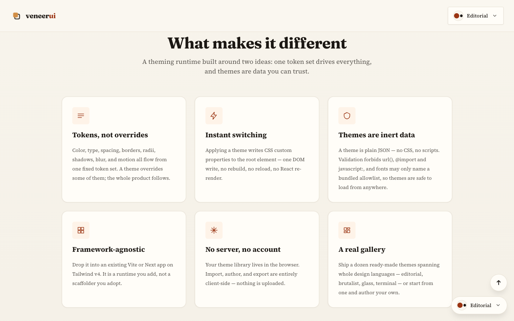
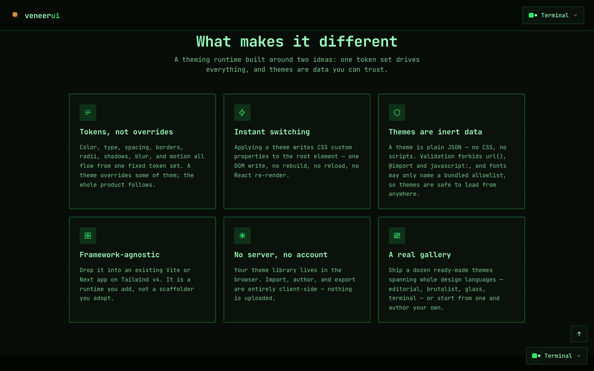
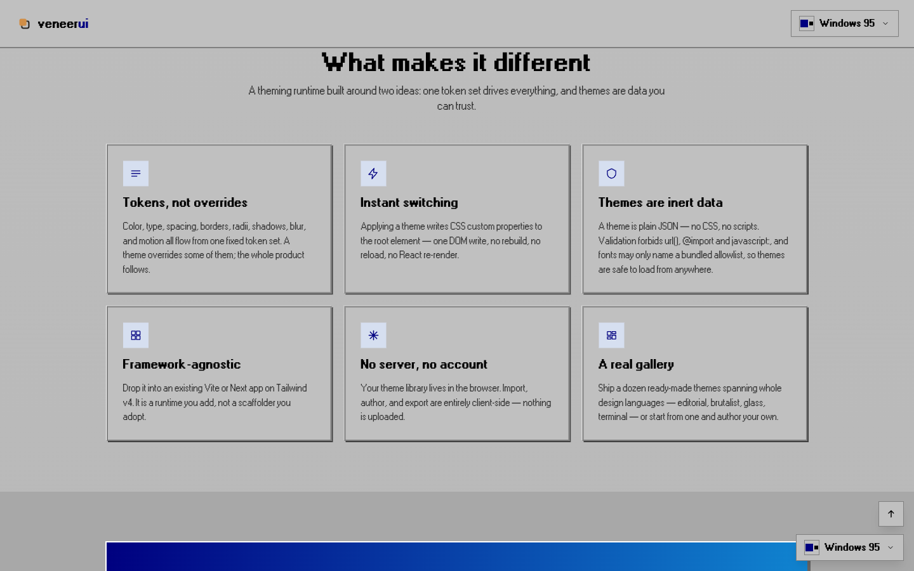
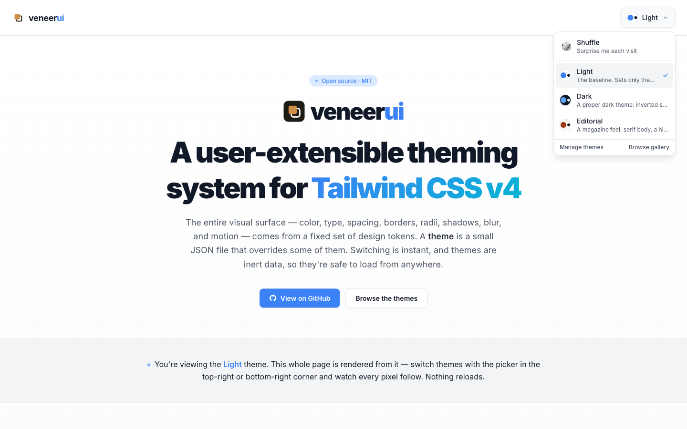

**Ship user-customizable theming in your Tailwind CSS v4 app.** Veneer drives your
entire visual surface — color, type, spacing, borders, radii, shadows, blur, and
motion — from one fixed set of design **tokens**. A *theme* is a small JSON file
that overrides some of those tokens. Switching is instant (one DOM write, no
re-render), so you can ship your own branded themes and let your users pick,
import, and author their own — all client-side, with no server and no account.

Because a theme is **inert data, not code**, it's validated and safe to load from
untrusted sources: a user's whole theme library lives in their browser.

**[▶ Live demo](https://veneerui.dev)** &nbsp;·&nbsp;
**Add it to your app** — [Vite](./docs/integration-vite.md) ·
[Next.js](./docs/integration-next.md) &nbsp;·&nbsp;
**Author a theme** — [guide](./docs/authoring-guide.md) ·
[tokens](./docs/schema-reference.md) &nbsp;·&nbsp;
**[Gallery](./gallery/README.md)**

---

## The same app, re-skinned by data

One UI, no component changes, no reload — every screen below is the identical
playground under a different theme:

| | | |
|---|---|---|
|  |  |  |
| **Brutalist** — thick borders, hard offset shadows | **Glassmorphic** — frosted panels, backdrop blur | **Neon Arcade** — synthwave glow on near-black |
|  |  |  |
| **Editorial** — serif display, magazine scale | **Terminal** — green CRT phosphor, all-mono | **Windows 95** — gray bevels, square corners |

[See them live →](https://veneerui.dev)

---

## What you can build

- **Your own branded theme set.** Define themes with `defineTheme` and ship them
  app-owned — non-deletable and re-seeded on every load. The natural fit for
  white-labeling or a few first-party light/dark options.
- **A drop-in theme switcher.** Add a `ThemeSwitcher` so users pick from your set
  with live preview swatches; the choice persists and re-applies before first
  paint, with no flash.
- **User-imported & user-authored themes.** Let people drop a `theme.json` or
  paste a URL — it's validated and previewed live before they save it, alongside
  your built-ins.
- **Showcase mode.** Shuffle a random theme on each visit to flaunt the range,
  until the visitor pins one.

---

## Add Veneer to your app

Veneer is a **drop-in add-on, not a scaffolder** — keep your own Vite/Next +
Tailwind v4 project and add Veneer on top, the way you'd add shadcn/ui.

```sh
npm i @offthegully/veneerui
npx veneerui init            # @import the tokens + wire the anti-flash, then print the provider step
npx veneerui add switcher    # copy a ThemeSwitcher into your components
npx veneerui doctor          # report how much of your existing UI is themeable today
npx veneerui migrate         # rewrite the mechanical hardcoded values to tokens
```

The one required interlock is a single line of CSS — `@import
"@offthegully/veneerui/tokens.css";` after `@import "tailwindcss";` — which makes
Tailwind v4 generate the token utilities Veneer overrides at runtime. The runtime
(`ThemeProvider`, `useTheme`, validation, import pipeline) is a normal dependency;
UI components are **copied into your project** (shadcn-style), because Tailwind v4
doesn't scan `node_modules`.

Step-by-step, CLI and manual:
**[Vite guide](./docs/integration-vite.md)** · **[Next.js guide](./docs/integration-next.md)**.

> **Next.js (App Router):** Veneer is SSR-safe. `init` adds
> `suppressHydrationWarning` to `<html>` (the anti-flash script sets theme
> variables before hydration), `add` prepends `'use client'` to copied
> components on a Next project, and the bundled `ThemeSwitcher` holds a
> theme-neutral first paint until mount so there's no hydration mismatch. To
> compute a default theme in a Server Component, import from the side-effect-free
> [`@offthegully/veneerui/themes`](./docs/integration-next.md#shipping-your-own-themes)
> subpath — the package root pulls in React context and can't be imported server-side.

### Ship your own themes

To ship *your* themes instead of the built-ins, author them with `defineTheme`
and pass them to the provider:

```tsx
import { ThemeProvider } from '@offthegully/veneerui'
import { defineTheme } from '@offthegully/veneerui/themes' // server-safe subpath

const themes = [
  defineTheme({ id: 'brand', name: 'Brand', tokens: { 'color-primary': '#5b21b6', /* … */ } }),
  defineTheme({ id: 'brand-dark', name: 'Brand Dark', tokens: { /* … */ } }),
]

// <ThemeProvider themes={themes} defaultThemeId="brand">…</ThemeProvider>
```

A theme can change as much or as little as you like — only colors for a quick
re-skin, or radius, shadow, border width, type, and motion for a full redesign.
Anything you omit falls back to the schema default.

---

## Migrate an existing app

Wiring Veneer in is the easy 10%. The real work is **moving your existing styles
onto tokens** — Veneer only re-skins elements that use token utilities
(`bg-surface`, `text-text`, `border-border`), so a freshly-wired app mostly won't
change until its hardcoded colors, baked shadows, and fixed sizes are migrated.
Three tools make that a measured task instead of a surprise.

**See how far you have to go.** `veneerui doctor` scans your project and reports
roughly what share of your UI is themeable today, broken down by what's blocking it:

```text
$ npx veneerui doctor
  ~31% themeable — 9 of 13 file(s) still hold 37 un-themed island(s):
       17  border-width
       11  box-shadow
        6  opacity
        3  arbitrary-size
  ⚠ 2 @theme token collision(s) — these silently shadow Veneer's tokens:
       app/globals.css: --color-primary
```

That last warning is the most common adoption trap: a **shadcn** (or other)
`@theme` block redefining a token name Veneer owns silently shadows it, so
`bg-primary` half-works. `doctor` calls those out by name.

**Do the mechanical 80%.** `veneerui migrate` rewrites the deterministic gotchas
in place — the ones that *look* themeable but bake at build time:

| Hardcoded | Veneer-themeable form |
|---|---|
| `shadow-lg` | `[box-shadow:var(--shadow-lg)]` |
| `border`, `border-2` | `[border-width:var(--border-width-default)] border-border` |
| `duration-200` | `duration-[calc(var(--duration-default)*1ms)]` |

It never guesses the judgment calls — which palette maps to `bg-primary` vs
`bg-accent`, whether a surface is raised or sunken, which scale step an arbitrary
size rounds to — it **flags** those with a `file:line` for you to finish. Run
`veneerui migrate --dry-run` to preview.

**Keep it from regressing.** Add
[`eslint-plugin-veneer`](./packages/eslint-plugin) — the same hardcoded-color
detector `doctor` uses, enforced in your editor and CI so the next `bg-blue-500`
fails the build instead of quietly adding an un-themed island.

```js
// eslint.config.js
import veneer from 'eslint-plugin-veneer'
export default [veneer.configs.recommended]
```

The token vocabulary and the full "looks right but breaks theming" table that
these tools encode live in **[AGENTS.md](./AGENTS.md)**.

### Let users bring their own

Users browse your set in a switcher, or open **Manage themes** to pick from a
gallery, drop a `theme.json`, or paste a URL — every theme is validated and
previewed live before they keep it.

| | | |
|---|---|---|
|  |  |  |
| **Switch** — pick from your set | **Browse** — apply by look | **Import** — file or URL, validated locally |

---

## Authoring a theme

There's no in-app editor — you author JSON in your own editor and preview it live
in a running app. Copy the closest [gallery](./gallery/README.md) theme, keep its
`$schema` line for autocomplete, edit the values you care about, then drop the file
into **Manage themes** to preview and save.

The **[authoring guide](./docs/authoring-guide.md)** covers picking a coherent
palette (the light/dark surface flip, the `text-on-primary` trap, contrast), and
the generated **[token reference](./docs/schema-reference.md)** lists every token
you can set.

---

## How it works

Tokens are declared in Tailwind v4's `@theme` block, so each one emits both a CSS
custom property *and* a utility class (`--color-primary` → `bg-primary`). Your
components use only those semantic utilities — never a hardcoded hex. `applyTheme()`
writes a theme's values as inline custom properties on `<html>`, which outrank the
`:root` defaults — so a switch re-skins everything instantly with no re-render.

Themes are **validated, not trusted**: a theme is *rejected* (never silently
degraded) if it uses unknown tokens, invalid CSS values, or any dangerous pattern
(`url()`, `@import`, `javascript:`, …), and fonts may only name a bundled
allowlist. Because a theme can only set declared variables that compiled utilities
already consume, there's no path from a theme to new CSS, modified HTML, or
executed code — the [token schema](./docs/schema-reference.md) is the entire
attack surface.

---

## Local development

This is an npm **workspace** monorepo: `packages/theme` (the `@offthegully/veneerui`
runtime), `packages/cli` (the `veneerui` CLI), `packages/eslint-plugin`
(`eslint-plugin-veneer`), `packages/lint-core` (the private, shared
hardcoded-value detector + conversion table the CLI/plugin/conformance test all
reuse), and `apps/playground`. Clone it to hack on Veneer itself or to preview
themes against the live playground. **Prerequisites:** Node 20+ and npm.

```sh
git clone https://github.com/offthegully/veneerui.git && cd veneer
npm install
npm run dev          # builds @offthegully/veneerui, then runs the playground at http://localhost:5173
```

The playground is the dev harness: it ships the gallery themes with the switcher,
import, and live-preview flow wired up, so dropping a `theme.json` into **Manage
themes** is how you preview a theme you're working on.

| Command | What it does |
|---|---|
| `npm run dev` | Build `@offthegully/veneerui`, then run the playground dev server |
| `npm run build` | Generate artifacts → build the package, playground, and CLI |
| `npm run gen:theme` | Regenerate the tokens CSS / JSON Schema / token reference from `TOKEN_SCHEMA` |
| `npm run lint` | ESLint across workspaces (incl. the `veneer/no-hardcoded-colors` rule) |
| `npm run typecheck` | Type-check every workspace |
| `npm test` | Vitest across every workspace |

`packages/theme/src/schema.ts` is the single source of truth — the canonical
`TOKEN_SCHEMA`. `npm run gen:theme` regenerates everything downstream (tokens CSS,
JSON Schema, token reference), so nothing hand-edited can drift. Two gates keep the
app themeable: the `veneer/no-hardcoded-colors` lint rule fails CI on raw color
utilities, and a conformance test proves a drastic theme switch re-skins 100% of
the UI. See **[AGENTS.md](./AGENTS.md)** for the rules on writing themeable
components.

---

## Further reading

- **Add Veneer to your app** — [Vite](./docs/integration-vite.md) ·
  [Next.js](./docs/integration-next.md)
- **Migrate an existing app** — `veneerui doctor` / `veneerui migrate` and
  [`eslint-plugin-veneer`](./packages/eslint-plugin)
- **Author a theme** — the [authoring guide](./docs/authoring-guide.md) and the
  generated [token reference](./docs/schema-reference.md)
- **The gallery** — [example themes](./gallery/README.md) and how to
  [contribute one](./gallery/CONTRIBUTING.md)
- **Maintainers** — release & `SCHEMA_VERSION` policy in
  [docs/publishing.md](./docs/publishing.md)
